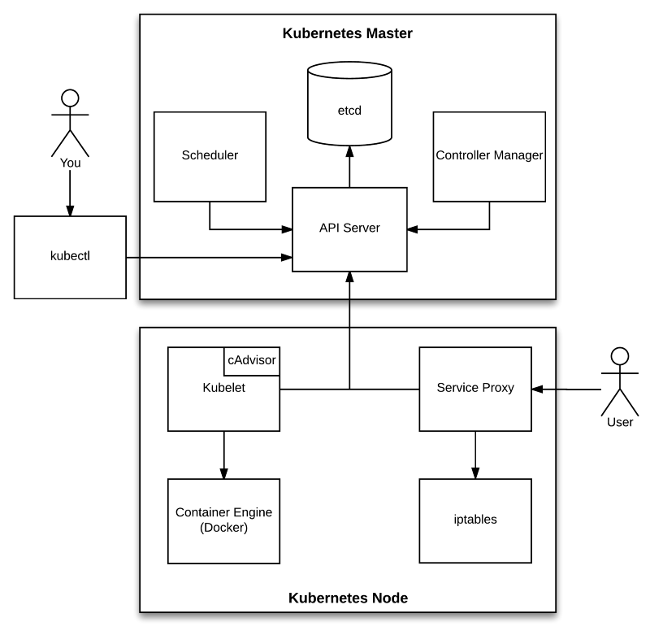

autoscale: true
slidenumber: true
footer: PayEx Group © 2018
theme: PayEx

# Intro til Kubernetes

### *Even Holthe (POS Server/TMS)* 

[.slidenumber: false]
---

# Kubernetes ?

---

# Hva er Kubernetes ?

- Orkestrering for containere og tilhørende ressurser
- Deklarativ approach
- Cluster med ulike komponenter
- Utviklet av Google i Go (2014), nå et CNCF-prosjekt m/Red Hat, Microsoft og andre.
- Kan kjøre på GCP, AWS, Azure, OpenStack, vSphere og bare-metal
- Finnes i ulike distribusjoner, f.eks. OpenShift

^ k8s tilbyr et sentralt sted for å definere containere (som kan kjøre sammen), eksponere tjenester for interne/eksterne konsumenter, konfigurasjonsstyring, skalering av instanser etc.

^ Alle handlinger som utføres er deklarativt beskrevet i YAML. k8s differ ønsket state mot current state og korrigerer.

^ k8s fungerer som en clustet løsning, bestående av ulike komponenter. Grovt sett kan man dele de ulike komponentene inn i 2 hovedkategorier. Disse inneholder flere ulike komponenter i seg selv.

^ Utviklet internt hos Google, basert på deres interne Borg og Omega-system. Det finnes et Borg-paper fra 2015. Internt hos Google kjører alt i en container - det launches over 2 milliarder containere i uken.

---

# [fit] `Docker != Kubernetes`

Docker

- Glorifiserte `.tar.gz`-filer
- Innkapsulerer en applikasjon med alt den trenger for å kjøre
- Package once, run anywhere
- Immutable images
- Manuell orkestrering (start/stop/ny versjon) av applikasjoner
- **Uavhengig av orkestreringslag**

Kubernetes

- Trenger en container runtime (Docker)
- Containere som "lego-klosser"
- Styrer nettverk/livssyklus/dependencies for containere (indirekte)

---

# Hva tilbyr Kubernetes?

- Logisk infrastruktur
- Automatisk gjenoppretting fra feilscenarier
- Service discovery
- Lastbalansering
- Skalerbarhet
- Nye utfordringer!
- ...

^ Man har en boks med "lego-klosser" som inneholder ulike logiske infrastruktur-komponenter. Disse kan man sette sammen som man vil. For en del av disse komponentene er det opp til cluster-leverandør og faktisk levere den relle infrastrukturen (f.eks. disker)

^ Feilscenarier: Et eksempel på dette er health- og readiness-sjekker

^ Tjenester blir automatisk tilgjengelig via intern DNS, miljøvariabler

^ Lastbalansering (TCP/HTTP) mellom ulike instanser av din applikasjon. Kan legge til og fjerne instanser dynamisk på bakgrunn av health og readiness-checks.

^ Lar deg manuelt skru opp og ned antall instanser av din applikasjon. Også mulig å gjøre dette automatisk basert på f.eks. metrics.

^ Distribuerte systemer stille andre krav til de som drifter og utvikler. State er distribuert, applikasjons-instanser kan komme og gå, uten at det er noe unormalt. Kan oppleves annerledes enn de hellige VM'ene man har i dag, som alle er på fornavn med.

^ Det er også mange flere muligheter, som batch-jobber, RBAC, støtte for stateful apps

---

# Viktige begreper

| Begrep         | Forklaring                                        |
|----------------|:--------------------------------------------------|
| `pod`          | abstraksjon for en eller flere containere         |
| `service`      | en permanent måte å aksessere flyktige pods på    |
| `volume`       | et sted man kan lagre persistente data            |
| `namespace`    | mekanisme for å scope ressurser på                |

---

# Arkitektur [^1]

^ kubectl er kommandolinjeverktøyet for å kontrollere et cluster

^ Alle kommandoene utføres mot en API Server, som lagrer state i den distribuerte KV-storagen etcd

^ Kubelet: Sørger for at pod'er som skal kjøre på denne noden kjører og rapporterer tilbake til API-serveren. Inneholder også cAdvisor som samler inn, aggregerer og eksporterer metrics om CPU, minne, nettverk osv fra kjørende containere på noden.

^ Service Proxy holdes kontinuerlig oppdatert mot API serveren for å se etter endringer som påvirker nettverkskonfigurasjonen. Når det finnes endringer, manipulerer den iptables (Linux firewall) for å sørge for tjenester alltid er tilgjengelige.

^ Scheduleren følger med på nye pods, merker at de ikke har en node og assigner en ledig node ut i fra tilgjengelige ressurser

[^1]: Hentet fra [Kubernetes Node Components: Service Proxy, Kubelet, and cAdvisor](https://medium.com/jorgeacetozi/kubernetes-node-components-service-proxy-kubelet-and-cadvisor-dcc6928ef58c)

---

# Arkitektur av **din app** [^2]

- Lagre konfigurasjonen utenfor applikasjonen
- Databaser, meldingskøer og tredjeparts-tjenester anses som utbyttbare avhengigheter
- Separer bygging fra kjøring
- Stateless
- Samtidighet (concurrency)
- Miljøuavhengighet (dev/test/stage/prod)
- Logging til konsoll (`stdout`/`stderr`)

^ Konfigurasjon kan komme fra miljøvariables, et ekstern system eller en config-fil som leses inn.   

^ Disse avhengighetene skal kunne byttes uten kodeendringer (f.eks. bytte en connection string til Rabbit eller MS SQL)

^ Byggingen produserer artifacts, som skal kunne deployes når som helst uten å ha noen avhengigheter til selve byggingen.

^ Applikasjonen skal skrive og lese state fra en ekstern ressurs, slik at om en prosess dør kan en annen ta over uten manuell innblandelse.

^ Samtidighet styres av antall instanser av din applikasjon.

^ Miljøene skal være så like som mulig. Miljøene er kun definert av data, policies og miljønavn. Ingen `if(env == 'prod') …`

^ Logging skal kun sendes til konsollen. Da kan Kubernetes eller annet runtime miljø samle inn logger på en standardisert måte, uavhengig av teknologi. Herfra kan det sendes til f.eks. ElasticSearch.

[^2]: Dette er ikke harde krav, men gjør det lettere å håndtere din applikasjon i en containerisert/orkestrert verden. Fra [The Twelve Factor App methodology](https://en.wikipedia.org/wiki/Twelve-Factor_App_methodology).

---

[.slidenumber: false]
[.footer]
[.background-color: #000000]

---

# Takk!

Offentlige ressurser

- [Kildekode for denne introduksjonen](https://github.com/PayEx/k8s-intro)
- [The Illustrated Children's Guide to Kubernetes](https://www.youtube.com/watch?v=4ht22ReBjno)
- [kubelist - Your curated weekly kubernetes information reconciliation loop](https://kubelist.com/issue/latest)
- [Evry: Kubernetes Workshop :thumbsup:](https://github.com/evry-bergen/kubernetes-workshop)

Interne PayEx-ressurser

- [Helge Dahl: Kubernetes at a glance](https://wiki.payex.com/xwiki/bin/view/Blog/Kubernetes%20at%20a%20glance)
- `#dev-containers` på 